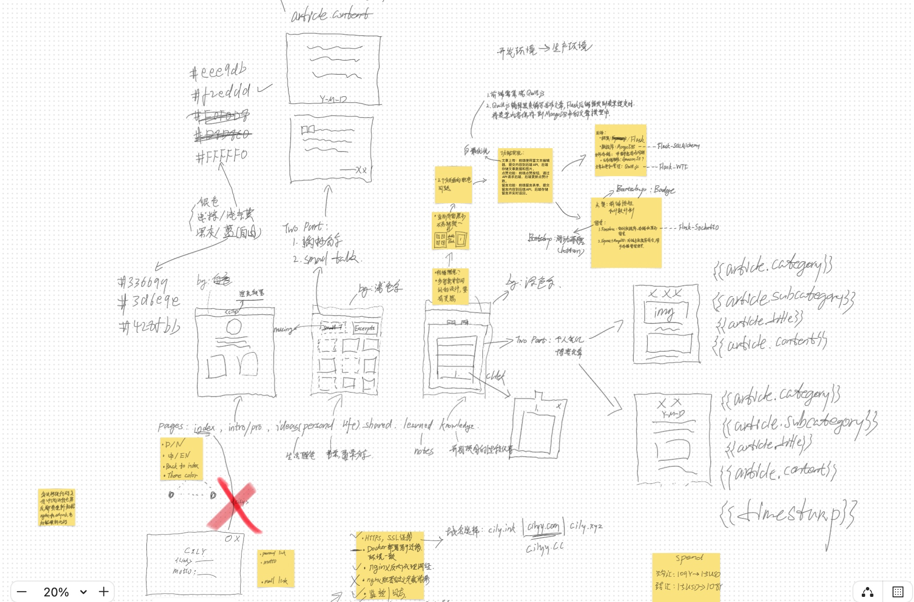
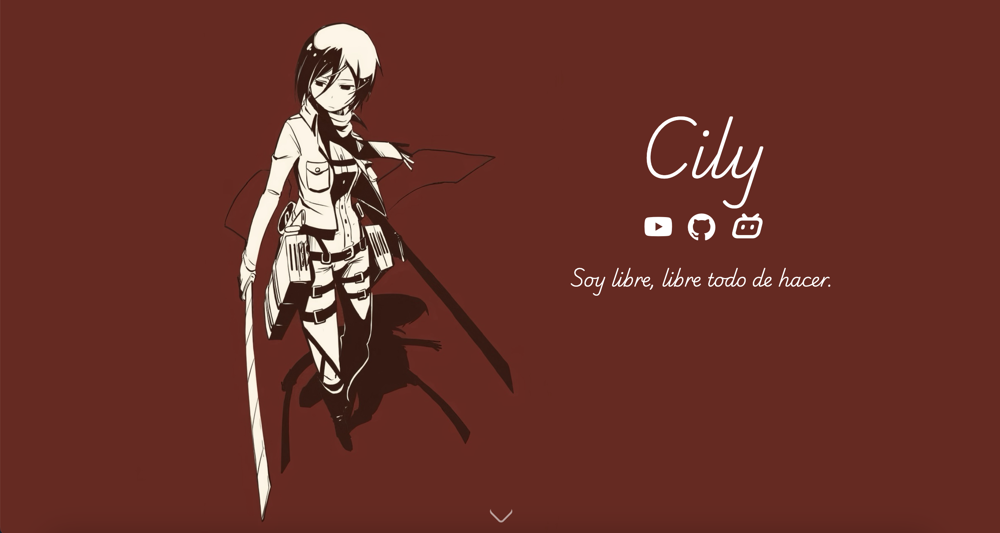
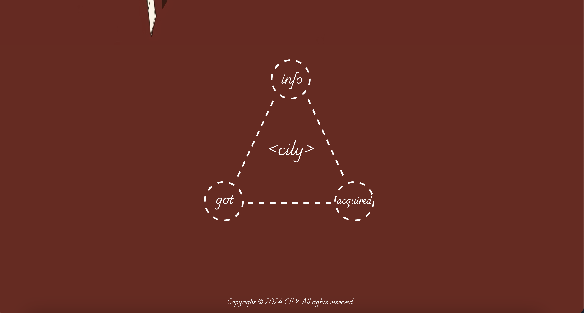
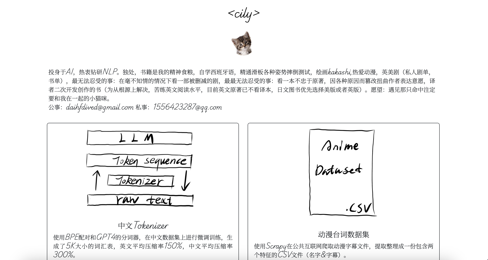
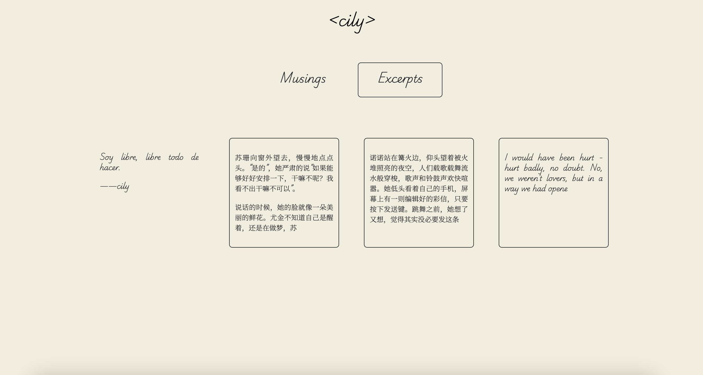
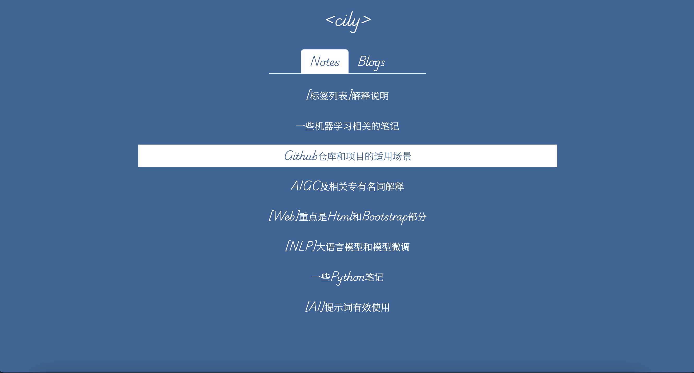

# Personal-Website-Build

### *[cilyy.com](https://cilyy.com/)*

## Info

- Front-End: HTML,CSS,JS and Bootstrap Frame, integrete Quill.js.
- Back-End: Flask
- Database: MongoDB
- System: Ubuntu 20.04
- WSGI-Server: Gunicorn
- Reverse-Proxy-Server: Nginx
- CDN: Cloudflare

## Bluemap

[More scratch](src/scratch)

[More info about my web dev](https://cilyy.com/acquired)
## Display

### *Home Page*

### *info Page*

### *got Page*

### *acquired Page*
